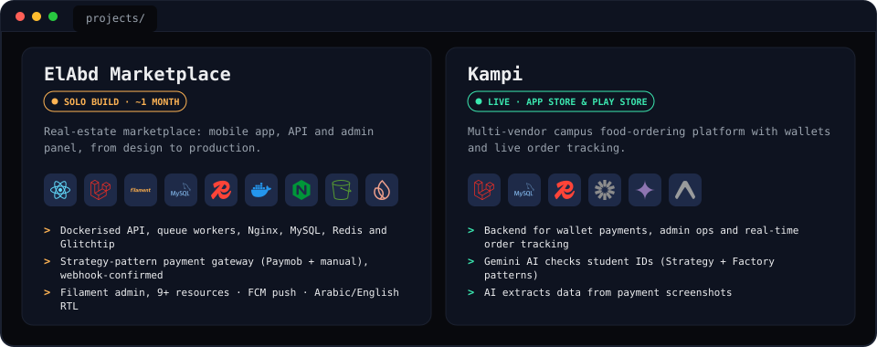

  

  
  
  
  
  

## 👋 About Me

## 💼 Experience

<b>Read the details</b>

- **Full Stack Software Engineer · Milango** (Jul 2026 – present) — Sole engineer building ElAbd Marketplace end to end: containerised backend, React Native app, production deploy.
- **Backend Engineer Intern · Milango** (Sep 2025 – Jan 2026) — Multi-tenant SaaS for 29+ enterprise clients (El Gouna, SODIC, Mountain View). Cut Filament form overhead by 40% by removing 25+ reactive calls; client-side caching for searchable selects.
- **Software Engineer Intern · e-finance** (Jul – Aug 2025) — Government payment systems: SOLID, design patterns, layered backend.
- **Instructor & Problem Setter · VuKids Academy** (2024 – 2026) — 50+ competitive programming problems, weekly C++ sessions.
- **Founder & Lead Instructor · ICPC BNU Community** (Dec 2022 – Jul 2026) — First ICPC community at BNU, 1,000+ students mentored, 20-hour C++ course on YouTube.

## 🎒 Inventory

## 🚀 Featured Projects

## 🏆 Achievements Unlocked

## 🐍 Contributions

<picture>
  <source media="(prefers-color-scheme: dark)" srcset="https://raw.githubusercontent.com/abdelrahmanharidyy/abdelrahmanharidyy/output/github-contribution-grid-snake-dark.svg">
  <source media="(prefers-color-scheme: light)" srcset="https://raw.githubusercontent.com/abdelrahmanharidyy/abdelrahmanharidyy/output/github-contribution-grid-snake.svg">
  
</picture>
